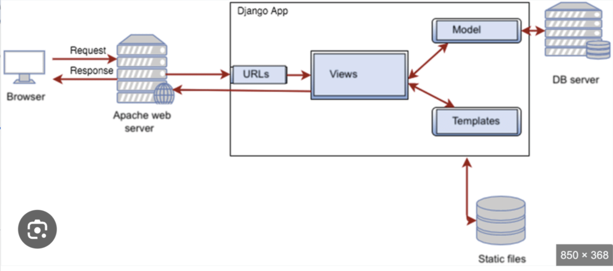

# Django Application Overview

This README file explains how a Django web application functions, using the architecture depicted in the diagram below.

## Architecture Diagram

## Overview of the Architecture

A Django app is a high-level web framework designed to encourage rapid development and clean, pragmatic design. The provided diagram outlines the key components and the flow of a request-response cycle in a typical Django application setup.

### Components of the Architecture

1. **Browser**: 
   - The starting point where a user initiates an HTTP request to access the web application.

2. **Apache Web Server**:
   - Acts as an intermediary between the client (browser) and the Django application. It handles incoming HTTP requests and forwards them to the Django application.
   - Sends back HTTP responses generated by the Django app to the client.

3. **Django App**:
   - The core of the application, responsible for handling the business logic and communicating with the database and templates.

   **Key Parts of the Django App**:
   - **URLs**: The routing mechanism that maps incoming HTTP requests to specific views within the Django application.
   - **Views**: Functions or classes in Django that receive HTTP requests, process data (including querying the database if needed), and return HTTP responses.
   - **Model**: The part of the application that handles the data structure and communicates with the database to retrieve, insert, update, or delete data.
   - **Templates**: Used to render dynamic HTML content that is sent to the client as part of the HTTP response.

4. **DB Server (Database Server)**:
   - A separate server or a service that stores and manages the data required by the Django app.
   - The Django `Model` interacts with the DB server to perform CRUD operations.

5. **Static Files**:
   - These include assets like CSS, JavaScript, and image files. They are served separately and are essential for the frontend's presentation.

### Flow of a Request-Response Cycle

1. **Request Initiation**:
   - The user sends a request from their browser to the Apache web server.

2. **Request Handling by Apache**:
   - The Apache server receives the request and forwards it to the Django application.

3. **Routing through URLs**:
   - The Django app's `URLs` module maps the request to an appropriate `View`.

4. **Processing by Views**:
   - The `View` handles the business logic, which may involve querying the `Model` to interact with the `DB server` to retrieve or modify data.

5. **Template Rendering**:
   - The `View` sends data to the `Template`, which generates an HTML response.

6. **Response Delivery**:
   - The rendered response is passed back to the Apache web server, which then sends it to the user's browser.

7. **Serving Static Files**:
   - When the response requires static assets (e.g., CSS for styling or JavaScript for interactive features), the browser requests these directly from the server serving static files.

### Summary

- The browser interacts with the Django app through the Apache server.
- The Django app processes the request through its URLs, Views, Models, and Templates.
- Data is fetched or updated from the database as needed.
- The response is sent back to the user, with static files served separately for enhanced performance and organization.

## Key Points

- **Modular Structure**: Django's architecture separates the app into components (URLs, Views, Models, Templates) for better organization and scalability.
- **Database Interaction**: Django's ORM (Object-Relational Mapping) is used to simplify database operations.
- **Serving Static Files**: Static files are managed separately for efficient loading and rendering.

This document provides a high-level overview of how a Django application works and its components' roles in handling and processing user requests.
